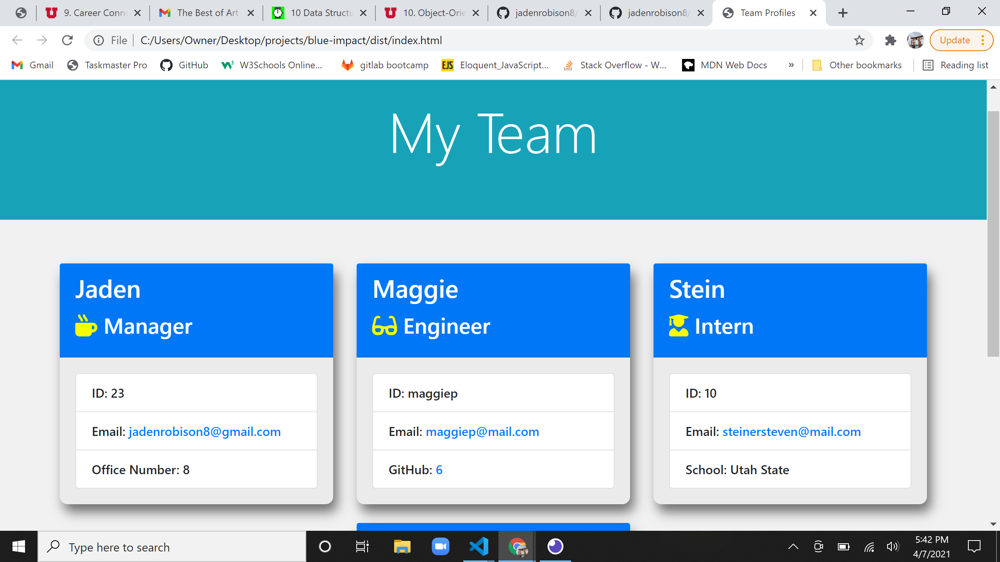
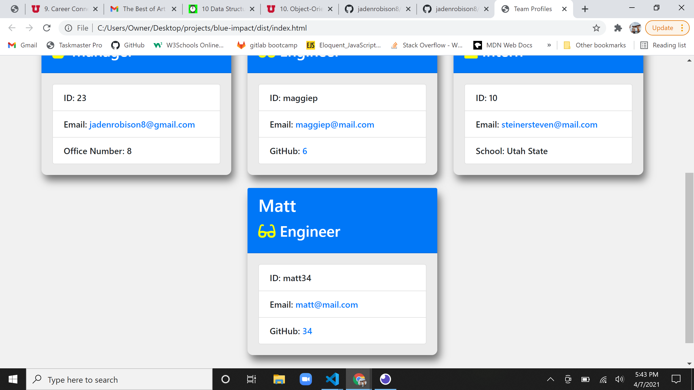

  # Blue-impact by Jaden Robison 

  

  ## Description
  A command-line application that generates team profiles

  ## Table of Contents
  * [Installation](#installation)
  * [Usage](#usage)
  * [Media](#media)
  * [Questions](#questions)
  * [Contributing](#contributing)
  * [Tests](#tests)
  * [License](#license)
  
  ## Installation
  Clone repository and install dependancies

  ## Usage
  From the command-line using node.js run the code index.js and follow the prompts 

  ## Media
  Screenshots: 
  
  

  ## Questions
  Github: github.com/jadenrobison8  
  Email: Jadenrobison8@gmail.com

  ## Contributing
  []
   
  ## Tests
  tests are run using jest. located in the __tests__ folder
  
  ## License
  [License](https://opensource.org/licenses/Apache-2.0)

